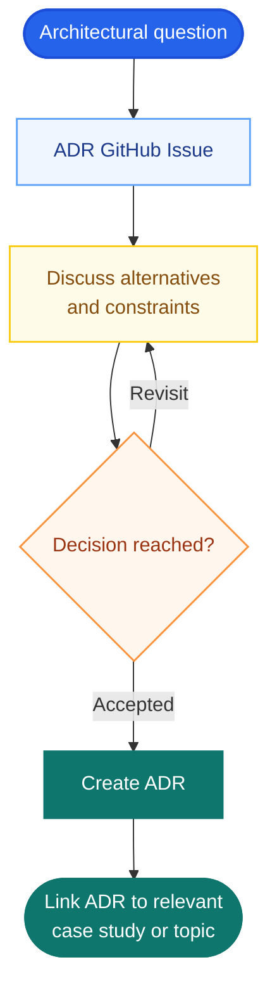

# Contributing to system-design-mastery

First off — thank you for being here. This project exists because developers share what they know, and every contribution, no matter how small, helps someone learn system design for free.

> If this project is useful to you or you want to follow along as it grows, please **star the repository** — it helps others discover it and motivates contributors to keep going.
> [⭐ Star system-design-mastery on GitHub](https://github.com/UdaySharmaGitHub/system-design-mastery)

Please read our [Code of Conduct](CODE_OF_CONDUCT.md) before participating. All contributors are expected to uphold it.

---

## Table of Contents

1. [Getting Started](#getting-started)
2. [Development Setup](#development-setup)
3. [Reporting Bugs & Gaps](#reporting-bugs--gaps)
4. [Suggesting Topics or Features](#suggesting-topics-or-features)
5. [Architecture Decision Records](#architecture-decision-records)
6. [Branch Naming Convention](#branch-naming-convention)
7. [Pull Request Process](#pull-request-process)
8. [Content Standards](#content-standards)
9. [Adding a New Topic](#adding-a-new-topic)
10. [Commit Message Format](#commit-message-format)
11. [Running CI Locally](#running-ci-locally)

---

## Getting Started

**Never push directly to this repository.** All contributions must come through a fork and a pull request — this protects the main branch and gives maintainers a chance to review every change.

### 1. Fork the repository

Go to the [system-design-mastery repository on GitHub](https://github.com/UdaySharmaGitHub/system-design-mastery) and click the **Fork** button in the top-right corner to create your own copy.

### 2. Clone your fork

Clone your fork, not the original repository, and move into the project directory:

```bash
git clone https://github.com/<your-username>/system-design-mastery.git
cd system-design-mastery
```

### 3. Add the upstream remote

Add the original repository as the `upstream` remote so you can pull in future changes:

```bash
git remote add upstream https://github.com/UdaySharmaGitHub/system-design-mastery.git
```

### 4. Verify your remotes

Check that Git lists both `origin` (your fork) and `upstream` (the original repository):

```bash
git remote -v
```

---

## Development Setup

This is a documentation repository — no runtime, no build step, no `npm install`.

**Recommended tools (optional but helpful):**

| Tool | Purpose |
|---|---|
| [markdownlint-cli](https://github.com/igorshubovych/markdownlint-cli) | Lint Markdown files before pushing |
| Any Markdown preview | Preview rendered output (VS Code, Typora, etc.) |

To install the linter locally:

```bash
npm install -g markdownlint-cli

# Lint all Markdown files
markdownlint "**/*.md" --ignore node_modules
```

---

## Reporting Bugs & Gaps

Before opening an issue, search [existing issues](https://github.com/UdaySharmaGitHub/system-design-mastery/issues) to avoid duplicates.

Use the **[Bug Report](.github/ISSUE_TEMPLATE/bug_report.md)** template and include:

- Which file or topic has the error
- What the content currently says
- What it should say (or what's missing)
- Your environment (browser, OS) if it's a rendering issue

---

## Suggesting Topics or Features

Use the **[Feature Request](.github/ISSUE_TEMPLATE/feature_request.md)** template. Be specific:

- "Add a case study for designing a rate limiter" is actionable.
- "Add more content" is not.

If a `good-first-issue` label is on an open issue, that means it's scoped and ready to pick up. Comment on it to claim it before starting work.

---

## Architecture Decision Records

Use an Architecture Decision Record (ADR) when an important architectural choice has meaningful alternatives, trade-offs, or long-term consequences. ADRs document reasoning rather than acting as generic technology guides.



Start with the [Architecture Decision issue template](.github/ISSUE_TEMPLATE/architecture_decision.md), then create the ADR using the [ADR template](architecture-decisions/template.md). Place reusable decisions in [`architecture-decisions/general/`](architecture-decisions/general/) and system-specific decisions in [`architecture-decisions/case-studies/`](architecture-decisions/case-studies/). Link accepted ADRs from the relevant HLD, LLD, pattern, or case-study document.

---

## Branch Naming Convention

All branches must follow this pattern: `<prefix>/<kebab-case-description>`

| Prefix | When to use |
|---|---|
| `docs/` | Fixing typos, improving explanations in existing content |
| `feature/` | Adding a new section or major piece of content that doesn't fit a narrower prefix |
| `hld/` | A new High-Level Design topic or section (e.g. `hld/load-balancing`) |
| `lld/` | A new Low-Level Design topic, class diagram, or code walkthrough (e.g. `lld/singleton-pattern`) |
| `case-study/` | A complete new case study (e.g. `case-study/url-shortener`) |
| `pattern/` | A new system design pattern (e.g. `pattern/consistent-hashing`) |
| `fix/` | Correcting an error in existing content |
| `infra/` | CI, templates, tooling, repo configuration |

### Grouped / Nested Branch Names

You can combine prefixes with a sub-group when your change belongs to a specific category within a domain. This makes large repos easier to navigate and groups related branches together in Git tooling.

Pattern: `<domain>/<sub-group>/<kebab-case-name>`

| Example | Meaning |
|---|---|
| `lld/pattern/<pattern-name>` | LLD walkthrough of a specific design pattern |
| `lld/case-study/<system-name>` | LLD deep-dive scoped to a particular case study |
| `hld/case-study/<system-name>` | HLD architecture for a particular case study |
| `hld/fundamentals/<topic>` | A foundational HLD concept (scaling, caching, etc.) |
| `fix/hld/<topic>` | Bug fix scoped to an HLD section |
| `fix/lld/<topic>` | Bug fix scoped to an LLD section |

**Examples:**

```
hld/fundamentals/caching
hld/fundamentals/load-balancing-strategies
hld/case-study/url-shortener
lld/pattern/singleton
lld/pattern/observer
lld/pattern/strategy
lld/case-study/chat-system
case-study/notification-system
pattern/consistent-hashing
pattern/rate-limiter
fix/hld/caching-diagram
fix/lld/singleton-code-error
docs/fix-load-balancer-typos
infra/add-markdownlint-config
```

> **Rule of thumb:** use a flat branch (`lld/observer-pattern`) for standalone topics; use a grouped branch (`lld/pattern/observer`) when the content lives under a named sub-folder in the repo.

---

## Pull Request Process

1. Create a branch from `main` following the naming convention above.
2. Make your changes. Keep each PR focused — one topic or fix per PR.
3. Run the Markdown linter locally: `markdownlint "**/*.md" --ignore node_modules`
4. Push your branch and open a PR against `main`.
5. Fill out every section of the [PR template](.github/pull_request_template.md).
6. Respond to reviewer comments within a reasonable time. If you go silent for 14 days, the PR may be closed.
7. A maintainer will merge once the CI check passes and the review is approved.

---

## Content Standards

Every topic in this repo follows a strict template. **Do not deviate from it** — consistency is the whole point.

```markdown
## Problem Statement
## Requirements
### Functional Requirements
### Non-Functional Requirements
## High-Level Design
## Low-Level Design & Code
## Trade-offs
## Production Reality
## Why NOT?
## Interview Angle
```

Additional rules:

- Write for someone who has never seen this topic before, but who is a working developer.
- Every diagram must have a written explanation. A diagram alone is not a contribution.
- Every code snippet must be correct and runnable (or clearly marked as pseudocode).
- No paywalled links. No affiliate links.
- Prefer plain Markdown diagrams (using code blocks or ASCII art) before adding image files.
- When adding images, place them in an `assets/` folder next to the Markdown file and use relative paths.

### Production Reality

This section must answer at least three of the following failure and scale questions for the system being designed:

- What happens if the cache (e.g. Redis) goes down?
- What happens if the message broker (e.g. Kafka) is delayed or unavailable?
- What happens if the primary database becomes unavailable?
- What happens if one partition or shard becomes a hot spot?
- What happens when traffic increases 10× or 100×?
- What happens if a downstream service times out?
- What security surface does this system expose (auth, encryption, abuse vectors)?
- How would you know something is wrong? (logs, metrics, traces — what do you watch?)

Do not just list concerns. Each answer should explain the failure mode, the impact, and the mitigation or fallback strategy.

### Why NOT?

For every significant architectural decision in the topic, include an explicit rejection of the main alternative and the reason for the choice.

Format each decision as a short block:

```markdown
**Why [chosen technology / approach]?**
[One or two sentences on why it fits this system.]

**Why not [alternative]?**
[One or two sentences on why the alternative was rejected or where it would fall short here.]
```

Examples of decisions that require a Why NOT entry:

- Cache technology (Redis vs. Memcached vs. in-process)
- Queue / broker (Kafka vs. RabbitMQ vs. SQS vs. no queue)
- Database (relational vs. document vs. wide-column — and which one specifically)
- URL encoding strategy (hash vs. sequential counter vs. Base62 encoding)
- Consistency model (strong vs. eventual — and why that trade-off is acceptable here)

---

## Repository Folder Structure

```
system-design-mastery/
│
├── hld/                          # High-Level Design — language-agnostic
│   ├── fundamentals/             # Core concepts (caching, scaling, load balancing…)
│   └── case-studies/             # HLD architecture per classic system
│
├── lld/                          # Low-Level Design — includes code
│   ├── fundamentals/             # OOP principles, SOLID, UML — language-agnostic
│   ├── patterns/                 # Design patterns with multi-language implementations
│   │   └── <pattern-name>/
│   │       ├── README.md         # explanation, class diagram, trade-offs
│   │       ├── java/
│   │       ├── python/
│   │       ├── go/
│   │       ├── typescript/
│   │       └── cpp/              # add only if contributed
│   └── case-studies/             # LLD deep-dives with code, per system
│       └── <system-name>/
│           ├── README.md
│           ├── java/
│           ├── python/
│           ├── go/
│           └── typescript/
│
├── patterns/                     # System-level patterns (rate limiter, consistent hashing…)
│                                 # Language-agnostic — Markdown only
│
├── architecture-decisions/       # ADRs for reusable and case-study-specific choices
│   ├── general/
│   └── case-studies/
│
├── case-studies/                 # End-to-end walkthroughs linking HLD + LLD
│   └── <system-name>/
│       ├── README.md             # overview + links to hld/ and lld/ counterparts
│       ├── hld.md                # (optional — for smaller case studies)
│       └── lld.md                # (optional — for smaller case studies)
│
└── interview-prep/               # Interview playbook — language-agnostic
```

**Key rule:** `hld/`, `patterns/`, and `interview-prep/` are Markdown-only. Only `lld/` contains code, organised into per-language sub-folders.

---

## Adding a New Topic

1. Open an issue using the Feature Request template to propose the topic. Wait for a maintainer to label it `accepted` before starting.
2. Create a folder or file under the appropriate location using the structure above.
3. Use the full content template (see Content Standards above) in your `README.md`.
4. For LLD topics with code, add at least one language sub-folder. You do not need to cover all languages — other contributors can add more later.
5. Open a PR using the correct prefix (see Branch Naming Convention).

For architectural decisions, use the [ADR workflow](#architecture-decision-records), copy [architecture-decisions/template.md](architecture-decisions/template.md), and use the `architecture-decisions/general/` or `architecture-decisions/case-studies/` directory with a three-digit decision number.

---

## Commit Message Format

Follow [Conventional Commits](https://www.conventionalcommits.org/):

```
<type>(<scope>): <short description>
```

| Type | When to use |
|---|---|
| `docs` | Adding or updating content (most PRs will use this) |
| `fix` | Correcting an error in existing content |
| `feat` | Adding a new topic, section, or case study |
| `infra` | CI, tooling, templates, repo configuration |
| `chore` | Dependency bumps, minor housekeeping |

**Examples:**

```
docs(hld): add caching fundamentals section
feat(case-study): add URL shortener end-to-end walkthrough
fix(lld): correct singleton pattern code example
infra: add markdownlint CI workflow
```

---

## Running CI Locally

The CI workflow runs `markdownlint` on every push and PR. Run it before pushing:

```bash
npm install -g markdownlint-cli
markdownlint "**/*.md" --ignore node_modules
```

A zero-exit output means all checks pass. Fix any reported lines before opening a PR.
